<h1 align="center">Low-Power MCA — AD7980-based Multi-Channel Pulse Height Analyzer</h1>

<p align="center">
  <b>基于峰保持与 AD7980 的低功耗多道脉冲幅度分析系统</b><br>
  <sub>TH<sup>234</sup>U · STM32G474 · AD7980 · Hardware-Timed Peak Hold · USB CDC · 4096–65536 Channel MCA</sub>
</p>

<p align="center">
  
  
  
  
  
  
  
</p>

> [!NOTE]
> 这是一个完整的核电子学脉冲幅度分析链路，而不是单纯的 ADC 读数程序：模拟前端完成缓冲、峰值捕获和保持，独立硬件触发链产生确定性采样时序，STM32G474 完成 AD7980 Busy 事件读出与数据管理，PC 上位机实时形成多道能谱并计算 ROI、峰位、FWHM、分辨率、计数率和链路健康指标。
<p align="center">
  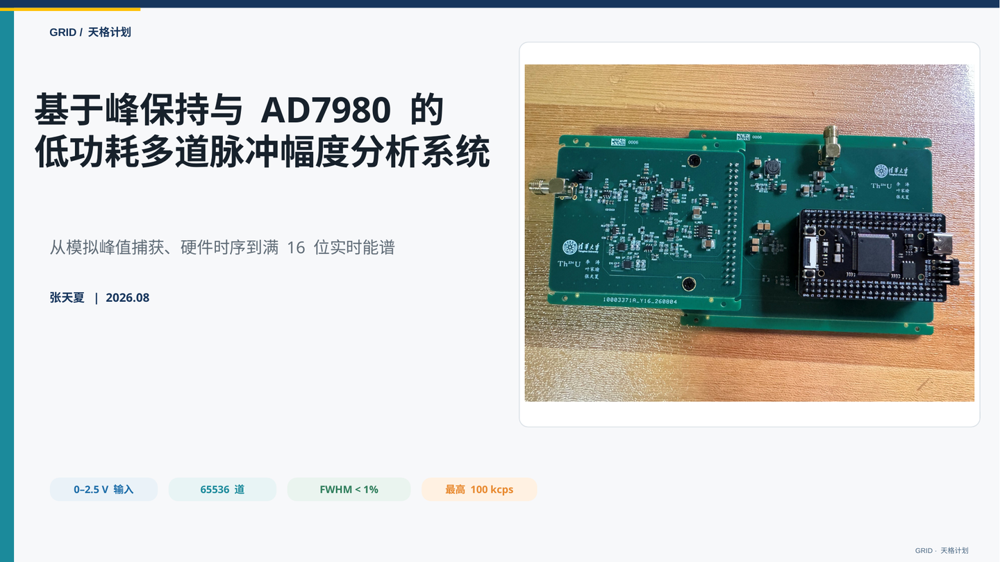
</p>
---

## 1. Project Overview

本项目面向核电子学脉冲幅度测量与多道能谱分析。核心设计思路是把 **幅度、时间和数据处理三条链路解耦**：

- **模拟幅度链**：`ADA4807 → BAT17 → 1 nF C_hold → THS4631 → AD7980`
- **硬件时序链**：比较器与单稳态逻辑产生 `Q_DELAY / CNV / SHDN`
- **数字采集链**：`AD7980 Busy → STM32G474 → USB CDC → PC MCA`

这种架构避免 MCU 软件中断抖动直接决定 ADC 采样相位。**CNV 始终由模拟硬件产生，MCU 不驱动 CNV。** MCU 只在转换完成后读取 16 位数据，并在串行口释放后发出 `PH_RESTART` 清空保持节点。

| 项目 | 当前实现 |
|---|---|
| ADC | AD7980，16-bit SAR，2.5 V spectrum full scale |
| MCU | STM32G474VET6，150 MHz |
| 外部测试输入 | 典型 0–1 V；前端约 2× 增益 |
| 能谱道数 | 4096 / 8192 / 16384 / 65536 |
| 采样触发 | 外部硬件 CNV，Busy 完成指示 |
| 高速链路 | 4096 道 MCU 本地直方图；高道数 B16 原码批传 |
| PC 通信 | USB Full-Speed CDC |
| 整机输入功耗 | **约 0.35 W @ 5.60 V**；空载至 100 kHz 约 61–63 mA |
| 可靠性 | sequence + CRC16-CCITT + USB recovery |
| 谱学分析 | ROI、Peak、Centroid、FWHM、Resolution、CPS |
| 数据导出 | CSV / TXT / PNG / 测试报告 |

---

## 2. System Architecture

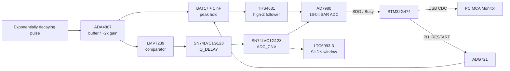

<p align="center">
  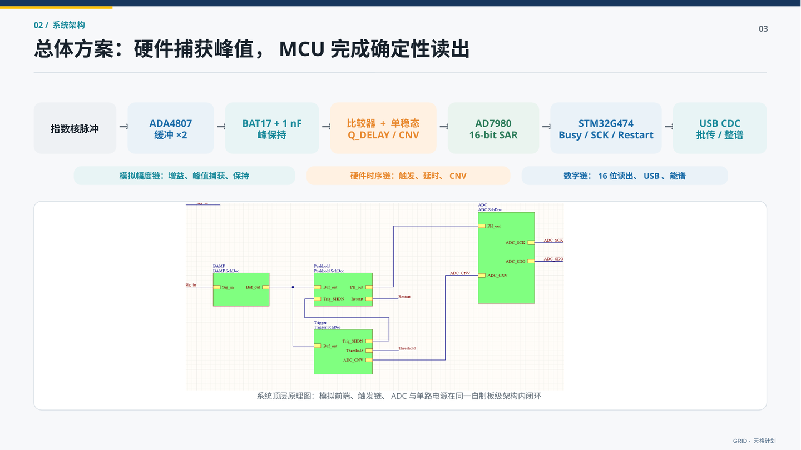
</p>

### 设计边界

1. 模拟链负责峰值捕获与保持。
2. 比较器 + 单稳态负责确定性时序。
3. STM32 负责 Busy 响应、16 位读出、统计、模式控制和 USB 数据通路。
4. PC 负责高道数重分道、谱学指标、校准、显示和数据归档。

---

## 3. Analog Front-End & Peak Hold

<p align="center">
  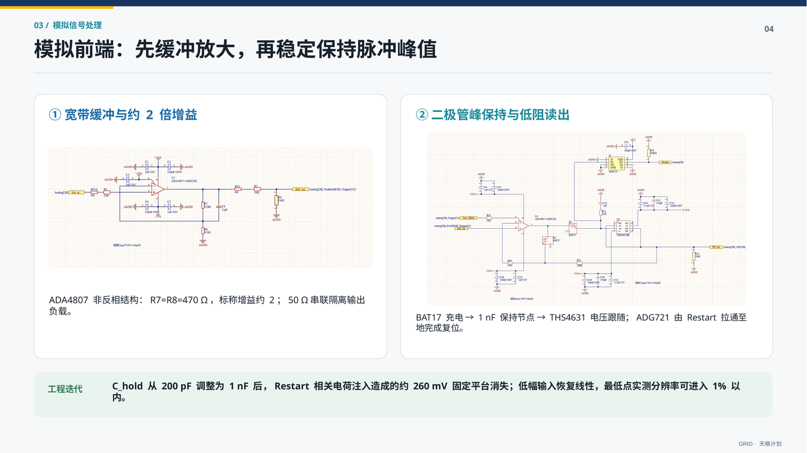
</p>

### 3.1 宽带缓冲与幅度映射

前端使用 ADA4807 非反相结构，`R7 = R8 = 470 Ω`，标称增益约为 2。该级负责隔离外部信号源并把测试输入映射到 AD7980 的可用输入范围。

### 3.2 峰值捕获

峰保持链路采用：

```text
ADA4807 → BAT17 → C_hold = 1 nF → THS4631 → AD7980
                         │
                         └─ ADG721 → AGND  (Restart discharge)
```

调试过程中，`C_hold` 从 200 pF 调整到 1 nF。该改动显著降低了 Restart、二极管恢复及开关电荷注入在低幅输入下造成的电压跃变量，原先约 260 mV 的固定平台消失，低幅线性和分辨率恢复。

> [!IMPORTANT]
> 1 nF 是当前实板的稳定基线，不应脱离当前二极管、缓冲器、Restart 时序和重复频率单独理解。更换峰保持器件或电容后，应重新测量建立时间、保持下垂、复位残留和最高重复频率。

---

## 4. Deterministic Hardware Timing

<p align="center">
  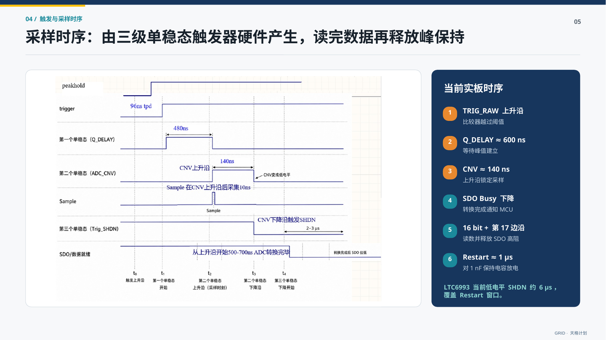
</p>

当前实板的典型时序如下：

```text
TRIG_RAW rising edge
        │
        ├─ Q_DELAY ≈ 600 ns       wait for peak-hold settling
        │
        ├─ ADC_CNV ≈ 140 ns       AD7980 samples on CNV rising edge
        │
        ├─ SDO/BUSY falling       conversion complete
        │
        ├─ 16 data clocks
        ├─ 17th release edge      return SDO to high-Z
        │
        └─ PH_RESTART ≈ 1 µs      discharge 1 nF hold capacitor

CNV falling edge → LTC6993-3 → SHDN low window ≈ 6 µs on current board
```

关键原则：

- CNV 不分配 MCU GPIO。
- Busy 下降沿触发 EXTI。
- 前 16 个 SCK 下降沿读取 `D15...D0`。
- 第 17 个下降沿仅用于释放 SDO 高阻状态。
- Restart 必须发生在数据读取和串行口释放之后。

---

## 5. STM32 Firmware Architecture

<p align="center">
  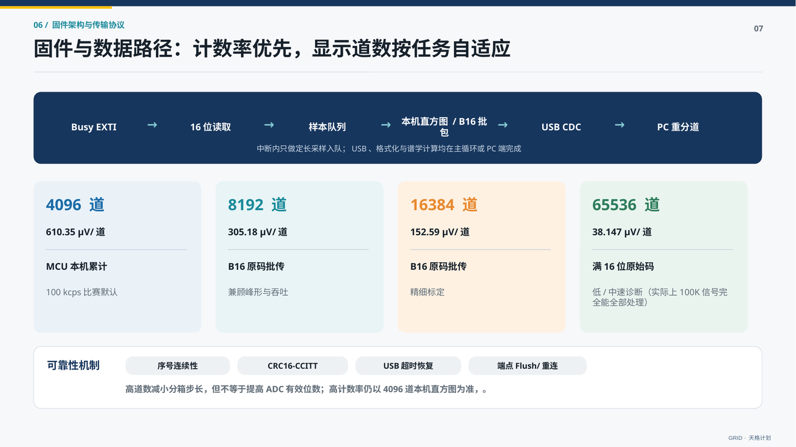
</p>

固件版本标识：

```text
fw=2.0.0-adaptive
```

采集主路径：

```text
Busy EXTI
   ↓
17-edge AD7980 readout
   ↓
fixed-size sample queue
   ↓
4096-bin local histogram  OR  raw16 B16 batch
   ↓
USB CDC
   ↓
PC re-binning / spectrum analysis
```

中断内保留确定时序的 ADC 读出与定长入队；USB 传输、字符串格式化和上位机谱学计算不放在中断中执行。

### 5.1 Adaptive channel modes

| 模式 | 理想道宽 @ 2.5 V | 数据路径 | 推荐用途 |
|---:|---:|---|---|
| 4096 | 610.35 µV/ch | MCU 本地累计完整直方图 | 最高吞吐、长时间连续采集 |
| 8192 | 305.18 µV/ch | 16-bit 原始码批传，PC 重分道 | 峰形与吞吐折中 |
| 16384 | 152.59 µV/ch | 16-bit 原始码批传，PC 重分道 | 精细标定 |
| 65536 | 38.147 µV/ch | 满 16 位原始码批传 | 原码诊断、最高显示粒度 |

> [!CAUTION]
> 65536 道表示使用完整 16 位码空间进行显示/统计，**不等于系统具有 16-bit ENOB**。实际有效分辨率仍由 ADC 噪声、2.5 V 基准、前端噪声、峰保持建立误差、触发时间游走以及信号源本身共同决定。

### 5.2 Raw16 batch protocol

8192 / 16384 / 65536 模式使用带序号和 CRC 的批量二进制数据：

```text
@B16,<first_sequence>,<count>,<crc16_ccitt>,<base64_payload>\r\n
```

- 每包最多 168 个样本。
- payload 为小端序 16 位 ADC 原始码。
- CRC：CRC16-CCITT，初值 `0xFFFF`，多项式 `0x1021`。
- `first_sequence` 用于发现 MCU 队列或 PC 接收造成的样本缺口。
- PC 重分道：

```text
channel = (raw_code * selected_channels) >> 16
V_adc_mV = raw_code * 2500.0 / 65536.0
```

### 5.3 Main command set

```text
help
status
channels 4096|8192|16384|65536
format b16
stream on|off
decimate N
threshold 50..200
profile baseline|amplitude|frequency
amp 100..900
freq 1..100
hist clear
hist dump
stats clear
```

其中 `threshold N` 中的 `N` 是**比较器端目标阈值（mV）**。固件自动补偿 9.1 kΩ / 1 kΩ 分压网络。

---

## 6. Hardware Safety & Pin Mapping

该工程把安全约束写入固件、CubeMX 配置和静态检查流程，而不是依赖上电后手工操作。

| MCU | Function | Direction / Policy |
|---|---|---|
| PA0 | ADC_BUSY_IRQ | EXTI falling input |
| PA1 | PH_RESTART | push-pull output |
| PA4 | THRESHOLD_DAC | DAC1_OUT1 |
| PA5 | ADC_SCK | push-pull output |
| PA6 | ADC_SDO | input only |
| PA11 / PA12 | USB DM / DP | USB CDC |
| PA2 / PA3 / PF2 / PC4 / PC5 | board-level GND-conflict pins | **Analog / High-Z / No-pull; never drive** |

同时：

- USART2 禁用。
- LCD/FPC 采集时应拔除或确保冲突线永久高阻。
- CNV 无 MCU GPIO assignment。
- 未使用的 FPC 数据脚显式配置为 Analog / no-pull，降低误驱动风险。

静态安全检查覆盖：接地针高阻、无 USART、USB 引脚、外部 CNV、16+1 SCK、读后 Restart、USB timeout/recovery 和阈值范围。

---

## 7. PC Monitor

<p align="center">
  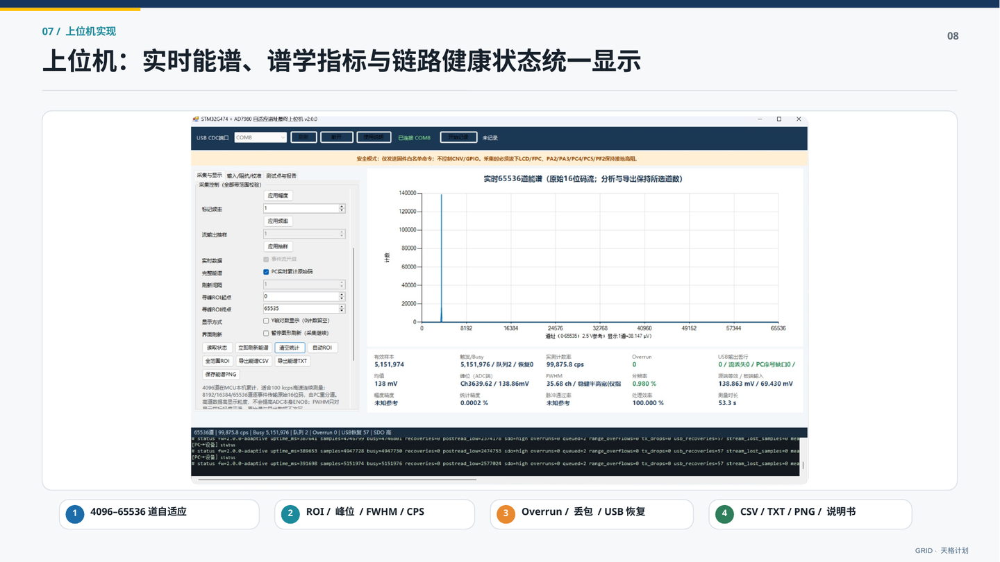
</p>

当前上位机：`NuclearMcaMonitor FinalAdaptive v2.6.2`

主要功能：

- 4096 / 8192 / 16384 / 65536 道模式自适应。
- 实时能谱与完整原谱统计。
- ROI、Peak、Centroid、FWHM、Resolution、CPS。
- 科学读数游标：道址、精确计数、ADC 中心电压、原始码范围、板端/源端等效幅值。
- 线性 / 对数纵轴。
- 主峰缩放、ROI 缩放、全谱复位和鼠标滚轮连续缩放。
- Overrun、序号缺口、USB recovery、processing efficiency 等链路健康状态。
- 输入阻抗、发生器幅值、前端增益与线性校准参数。
- CSV / TXT / PNG / 测试报告导出。
- 内置公式说明和安全提示。

上位机自检结果：**18 / 18 PASS**，并覆盖空谱显示、游标峰吸附、局部 FWHM、四种道址原子切换、对数轴、长文本指标、通过率/处理效率颜色逻辑和固件兼容性检查。

配套固件应报告：

```text
fw=2.0.0-adaptive
adc_spectrum_fs_mV=2500
hist_channels=<same as PC mode>
```

版本或模式不匹配时，不应使用上位机给出的绝对幅值结论。

---

## 8. Measured Performance

<p align="center">
  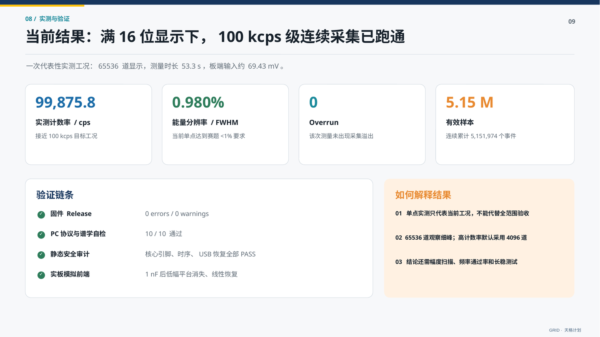
</p>

PPT 中记录的一次代表性满 16 位实测工况：

| Metric | Result |
|---|---:|
| Spectrum mode | 65536 channels |
| Measurement time | 53.3 s |
| Effective samples | 5.15 M |
| Measured rate | 99,875.8 cps |
| FWHM resolution | 0.980% |
| Overrun | 0 |
| Board input | ≈ 69.43 mV |

该结果证明从模拟峰保持、AD7980、STM32 数据路径到 PC 谱学分析已经形成闭环。它是**代表性工况**，不应被解释为所有幅度、所有温度和所有硬件版本下的保证值。

### 8.1 Latest 100 kHz linearity sweep

在后续 17 点、65536 道、约 100 kHz 的线性度测试中：

| Metric | Result |
|---|---:|
| Board-input range | 70.60–452.99 mV |
| Linear fit | `measured = 0.998313817 × actual + 0.301154732 mV` |
| R² | **0.999964841692** |
| Max span nonlinearity | **0.419106%** |
| Max absolute amplitude error | **0.455587%** |
| Max fit residual | **1.602623 mV** |
| Resolution range | **0.183–0.945%** |
| Mean measured rate | **99,860.4 cps** |
| DAQ processing efficiency | ≈ **100%** |

<p align="center">
  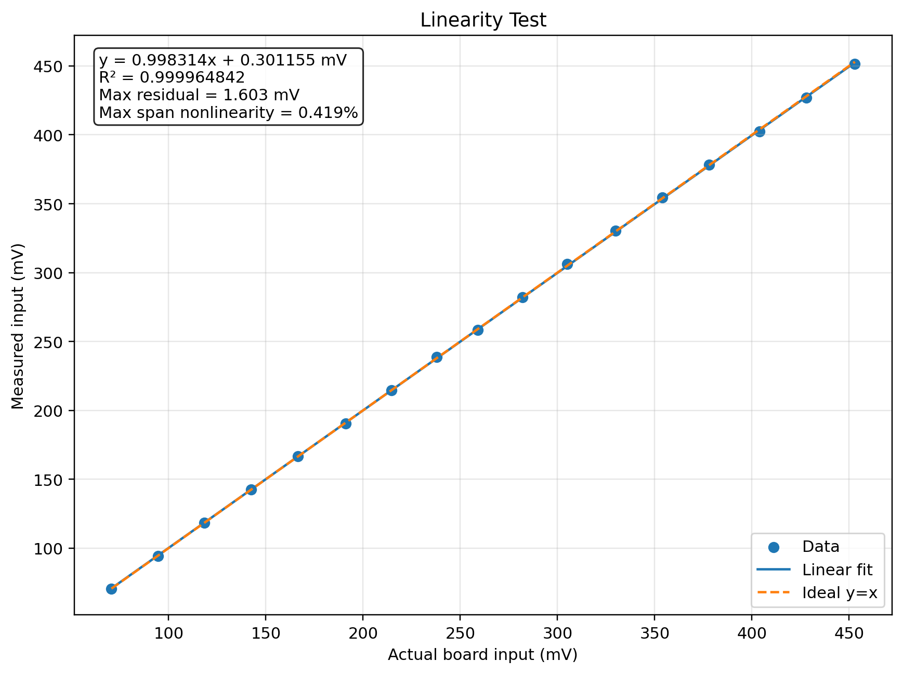
</p>

<p align="center">
  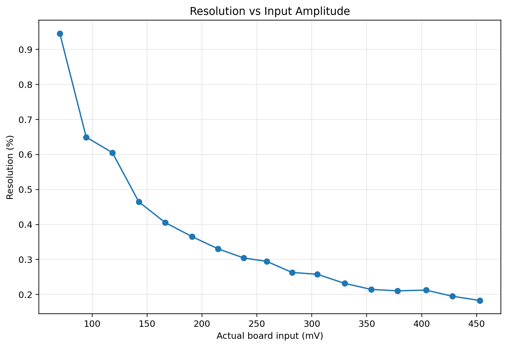
</p>


### 8.2 System power consumption

系统总输入电压为 **5.60 V**。在空载以及 1 kHz、50 kHz、100 kHz 三种事件率下，分别对 70、259、453、515、900 mV 典型输入幅度进行测试。

| 脉冲频率 | 输入幅度 / mV | 输入电流 / A | 输入功耗 / W |
|---|---:|---:|---:|
| 空载 | — | 0.062 | 0.347 |
| 1 kHz | 70 | 0.063 | 0.353 |
| 1 kHz | 259 | 0.063 | 0.353 |
| 1 kHz | 453 | 0.063 | 0.353 |
| 1 kHz | 515 | 0.062 | 0.347 |
| 1 kHz | 900 | 0.063 | 0.353 |
| 50 kHz | 70 | 0.061 | 0.342 |
| 50 kHz | 259 | 0.062 | 0.347 |
| 50 kHz | 453 | 0.062 | 0.347 |
| 50 kHz | 515 | 0.062 | 0.347 |
| 50 kHz | 900 | 0.063 | 0.353 |
| 100 kHz | 70 | 0.061 | 0.342 |
| 100 kHz | 259 | 0.062 | 0.347 |
| 100 kHz | 453 | 0.062 | 0.347 |
| 100 kHz | 515 | 0.062 | 0.347 |
| 100 kHz | 900 | 0.063 | 0.353 |

<p align="center">
  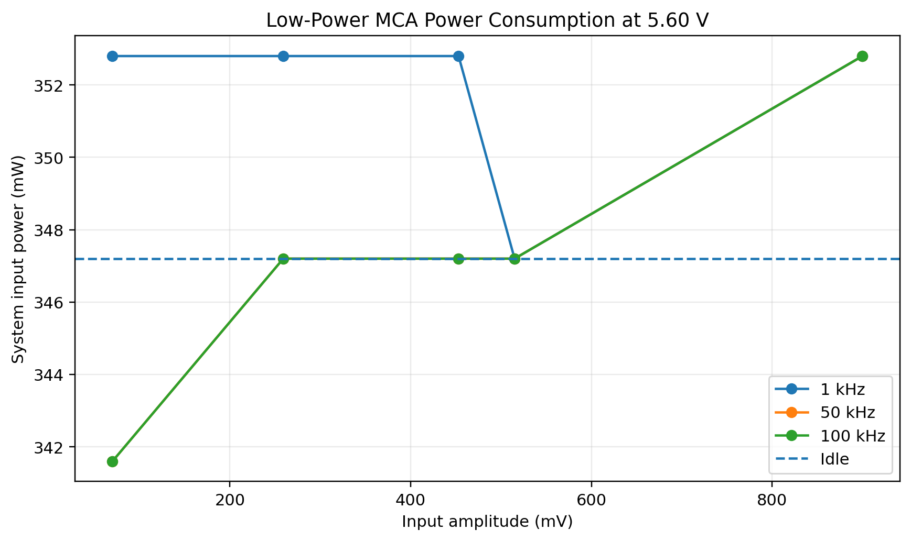
</p>

测试记录的输入电流范围为 **61–63 mA**，对应整机输入功耗约 **0.342–0.353 W**；全部 16 个记录点的平均功耗约为 **0.349 W**。其中空载约为 **347.2 mW**，100 kHz 五个幅度点的平均功耗同样约为 **347.2 mW**。

在本次测试覆盖范围内，未观察到功耗随输入幅度或事件率显著增加的趋势。因此系统级功耗可概括为：

> **≈ 0.35 W total input power @ 5.60 V, essentially unchanged from idle to 100 kcps and across 70–900 mV input amplitude.**

完整测试记录见 [`docs/POWER_CONSUMPTION_TEST.md`](docs/POWER_CONSUMPTION_TEST.md)。

---

## 9. Build & Flash

### Requirements

- STM32CubeIDE 1.16.x or compatible version
- STM32G474VET6 target board
- ST-LINK / SWD
- Windows PC for the current WinForms monitor
- USB cable for CDC communication

### Build firmware

```text
1. Open firmware/STM32G474_AD7980_FinalAdaptive/STM32CubeIDE
2. Select Release configuration
3. Clean Project
4. Build Project
5. Flash with STM32G474_AD7980_FinalAdaptive.launch
```

Prebuilt images are provided under:

```text
firmware/STM32G474_AD7980_FinalAdaptive/Firmware/
├── STM32G474_AD7980_FinalAdaptive.hex
└── STM32G474_AD7980_FinalAdaptive.bin
```

### Start PC monitor

```text
firmware/STM32G474_AD7980_FinalAdaptive/PC_Monitor/启动上位机.bat
```

or directly run:

```text
NuclearMcaMonitor_FinalAdaptive_v2.6.2.exe
```

---

## 10. Quick Start

> [!WARNING]
> 首次连接实板前，先完成断电蜂鸣检查和限流上电。不要直接在未知接线状态下连接 MCU、USB 和模拟板。

1. 断电检查 `PA2 / PA3 / PF2 / PC4 / PC5` 对应板级接地点。
2. 确认 `PA0 / PA1 / PA4 / PA5 / PA6` 没有对地短路。
3. 拔下 LCD/FPC，或确保冲突线保持高阻。
4. 限流上电，依次检查 `3.3 V / +5VA / -5VA / 2.5V_REF`。
5. 用示波器确认 `TRIG_RAW → Q_DELAY → CNV → Busy → 17×SCK → Restart` 的顺序。
6. 烧录 `STM32G474_AD7980_FinalAdaptive.hex`。
7. USB 连接 PC，启动上位机。
8. 发送/执行 `status`，确认固件版本与 2.5 V 映射兼容。
9. 根据任务选择 4096–65536 道。
10. 清谱后开始测量，观察 `samples / busy / overruns / USB recoveries / sequence gaps`。

---

## 11. Repository Layout

推荐仓库结构：

```text
Low-Power-MCA/
├── README.md
├── docs/
│   ├── POWER_CONSUMPTION_TEST.md
│   ├── Low-Power-MCA_系统功耗测试报告.docx
│   ├── power_consumption_test_data.csv
│   └── images/
│       ├── project_overview.png
│       ├── system_architecture.png
│       ├── analog_frontend.png
│       ├── hardware_timing.png
│       ├── firmware_data_path.png
│       ├── pc_monitor.png
│       ├── measured_performance.png
│       ├── linearity_fit.png
│       ├── resolution_vs_input.png
│       └── power_consumption.png
└── firmware/
    └── STM32G474_AD7980_FinalAdaptive/
        ├── Core/
        ├── Drivers/
        ├── Firmware/
        ├── Middlewares/
        ├── PC_Monitor/
        ├── STM32CubeIDE/
        ├── USB_Device/
        ├── tools/
        ├── DATA_FORMAT.md
        ├── HARDWARE_TIMING_AUDIT.md
        ├── PINOUT.md
        ├── TEST_PROCEDURE.md
        └── README.md
```

---

## 12. Engineering Notes

### Why hardware-generated CNV?

采样相位直接影响峰保持系统的幅度误差。把 CNV 放在比较器 + 单稳态硬件链中，可以避免 USB、主循环和普通软件中断抖动进入采样时刻。

### Why 17 SCK edges?

三线 Busy 模式下，前 16 个下降沿读取 `D15..D0`，第 17 个下降沿用于把 SDO 释放回高阻，为下一次 Busy 指示恢复总线状态。

### Why keep both 4096 and 65536 modes?

- 4096：减少高计数率下的 USB 每事件开销，适合长期吞吐。
- 65536：保留完整 16 位原始码，适合标定、峰形诊断和线性度分析。

二者是**数据路径/显示粒度的取舍**，不是 ADC 分辨率的开关。

### What does “processing efficiency” mean?

```text
processing_efficiency = processed_samples / busy_events × 100%
```

它表示 DAQ 对已发生 ADC Busy 事件的处理完成率，不是探测器的物理探测效率。

---

## 13. Current Status

- [x] 模拟缓冲与峰保持链路完成
- [x] 1 nF 峰保持改版完成，低幅固定平台消除
- [x] 外部硬件 CNV 时序闭环
- [x] AD7980 Busy + 16 bit + 17th release edge
- [x] 读后 PH_RESTART
- [x] 4096 道 MCU 本地直方图
- [x] 8192 / 16384 / 65536 B16 原码模式
- [x] USB sequence / CRC16 / recovery
- [x] PC 实时 MCA 与谱学指标
- [x] 65536 道近 100 kcps 连续采集代表性验证
- [x] 17 点 100 kHz 线性度测试
- [ ] 真实探测器 / 放射源的道址—能量标定
- [x] 系统级功耗测试：5.60 V 输入下约 **0.35 W**，空载至 100 kHz 基本稳定
- [ ] 温漂和长期稳定性定量报告

<p align="center">
  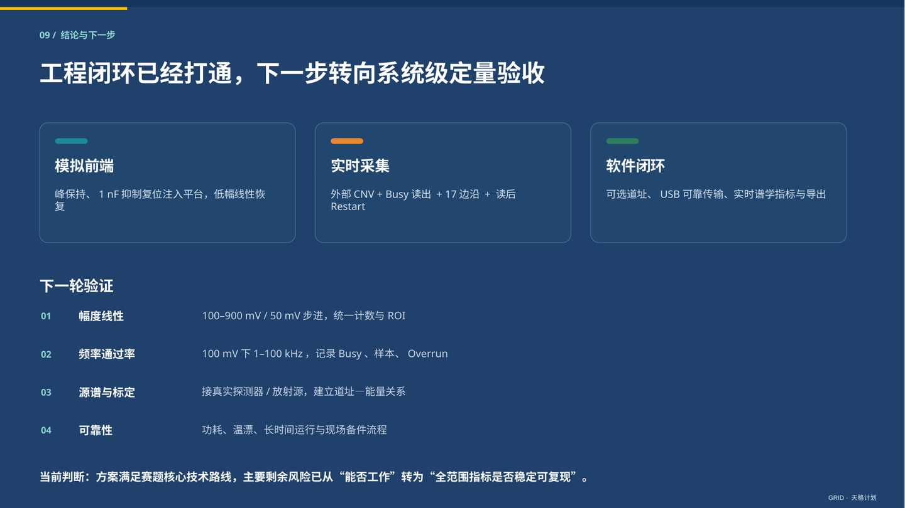
</p>

---

## 14. Documentation in the Firmware Package

工程内已经包含进一步的实现与审计文档：

- `README.md` — 固件与模式总览
- `DATA_FORMAT.md` — 4096 直方图与 B16 数据格式
- `PINOUT.md` — MCU/板级引脚与冲突审计
- `HARDWARE_TIMING_AUDIT.md` — AD7980 / 单稳态 / Restart 时序审计
- `CUBEMX_CONFIG.md` — CubeMX 配置说明
- `TEST_PROCEDURE.md` — 上板与性能测试步骤
- `SAFETY_CHECK_RESULT.txt` — 静态安全检查结果
- `PC_Monitor/README.md` — v2.6.2 上位机功能与使用说明
- `PC_Monitor/BUILD_REPORT.txt` — 上位机自检与构建结果

---

## 15. Project Identity

**Low-Power-MCA**  
TH<sup>234</sup>U · GRID / 天格计划  
2026.08

> 本 README 中的性能数字均对应文档或实测记录中的具体测试条件。高道数不等同于 ENOB；代表性单点结果不应外推为所有输入幅度、频率、温度与硬件版本下的保证指标。
